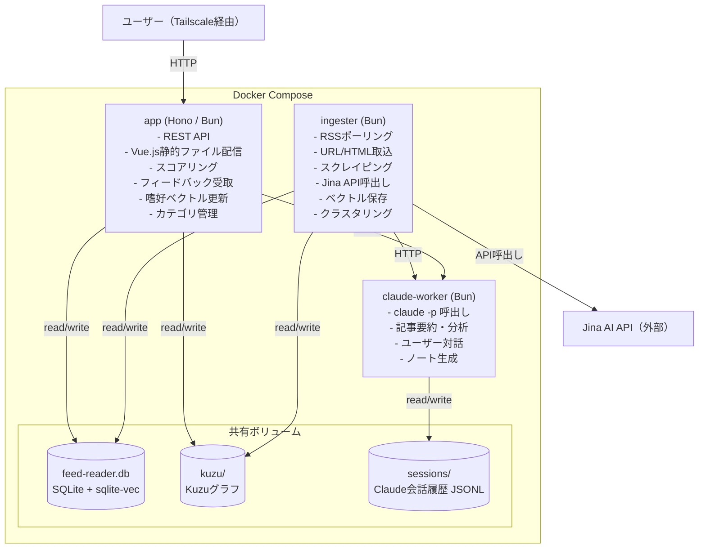
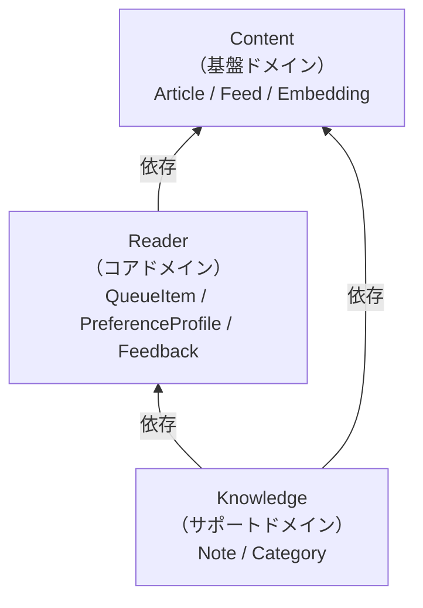
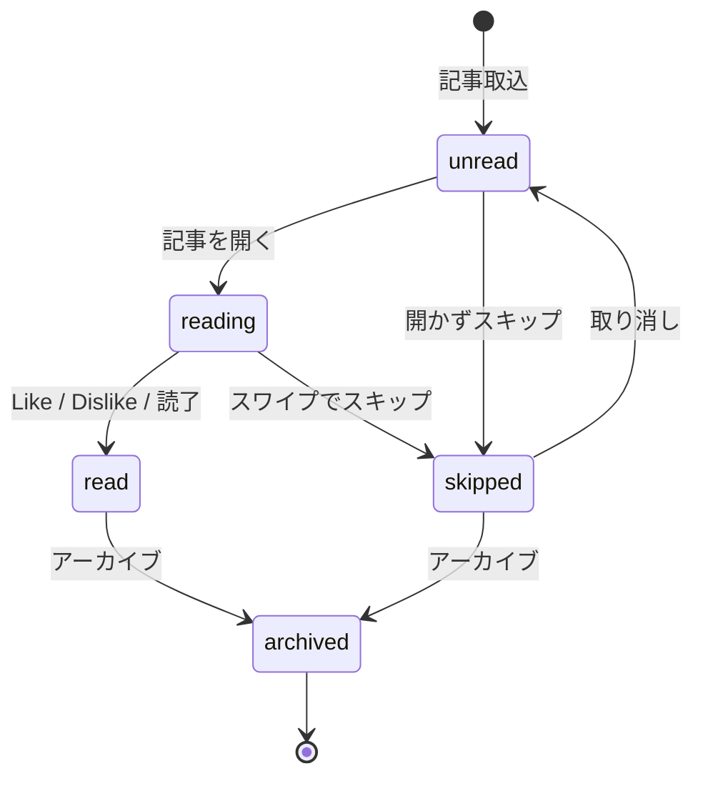
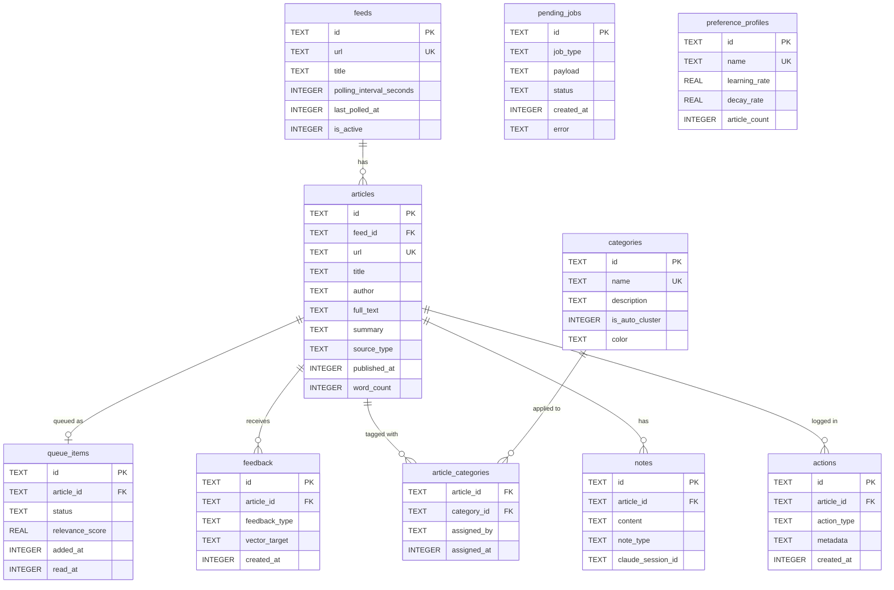
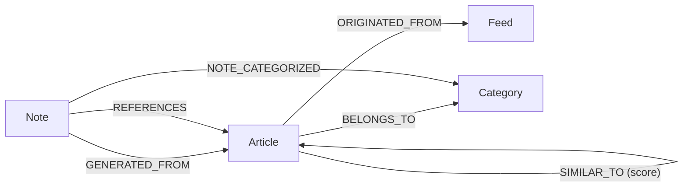
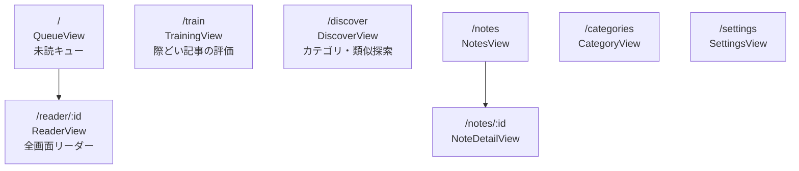
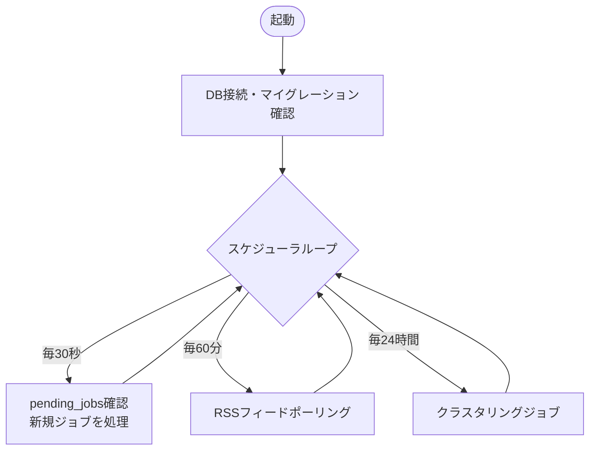
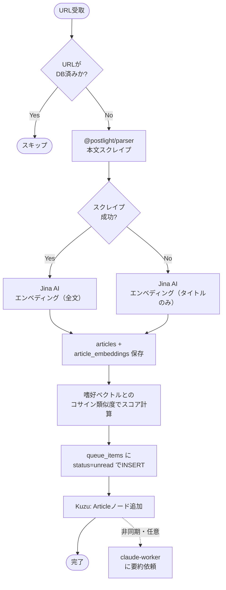
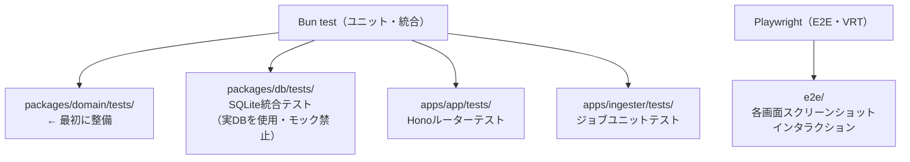

# アーキテクチャ設計書

作成日：2026年8月  
ステータス：設計確定 → 詳細設計・実装フェーズへ

---

## 1. システム構成

### コンテナ構成（Docker Compose）



### コンテナの役割分担

| | ingester | app | claude-worker |
|---|---|---|---|
| 起動形態 | 常時ループ（HTTPサーバーなし） | 常時待機（HTTPサーバー） | 常時待機（HTTPサーバー） |
| 外部通信 | Jina AI・RSS・スクレイピング | なし（DB + claude-worker） | Claude CLI |
| DB操作 | 読み書き（記事・キュー・ベクトル） | 読み書き（キュー・フィードバック・ノート） | 読み書き（ノート） |
| 障害時 | 次サイクルで回復 | 即座にUI停止 | 対話機能のみ停止 |

### コンテナ間通信

- **ingester ↔ app**: 直接HTTP通信なし。共有DBの `pending_jobs` テーブルを経由
  - app: URLをPOSTされたら `pending_jobs` にINSERT → 即200返却
  - ingester: 常時ループで `pending_jobs` を確認 → 新規あれば処理
- **app → claude-worker**: HTTP（Dockerネットワーク内部）
- **ingester → claude-worker**: HTTP（Dockerネットワーク内部）

---

## 2. モノレポ構成

```
feed-reader/                    # GitHub: peccu/feed-reader
├── apps/
│   ├── app/                    # Hono + Vue.js (Bun)
│   │   ├── src/
│   │   │   ├── server/         # Honoルーター・ミドルウェア
│   │   │   └── client/         # Vue.js フロントエンド
│   │   ├── tests/
│   │   └── package.json
│   ├── ingester/               # バックグラウンドジョブ (Bun)
│   │   ├── src/
│   │   │   └── jobs/
│   │   ├── tests/
│   │   └── package.json
│   └── claude-worker/          # claude -p ラッパー (Bun)
│       ├── src/
│       ├── tests/
│       └── package.json
├── packages/
│   ├── domain/                 # DDDドメインモデル（共有）
│   │   ├── src/
│   │   │   ├── content/
│   │   │   ├── reader/
│   │   │   └── knowledge/
│   │   ├── tests/
│   │   └── package.json
│   ├── db/                     # SQLite + Kuzu アクセス層（共有）
│   │   ├── src/
│   │   │   ├── sqlite/
│   │   │   └── kuzu/
│   │   ├── tests/
│   │   └── package.json
│   └── types/                  # 共有TypeScript型定義（APIのI/O型）
│       ├── src/
│       └── package.json
├── docker-compose.yml
├── .github/
│   └── workflows/
│       └── ci.yml              # PR時: lint・unit test・VRT
├── package.json                # Bun workspacesルート
└── biome.json                  # Linter / Formatter
```

---

## 3. 技術スタック

| レイヤー | 選択 | 補足 |
|---|---|---|
| ランタイム | Bun | 全コンテナ共通 |
| バックエンドAPI | Hono | appコンテナのみ |
| フロントエンド | Vue.js 3 + Vite | Composition API + `<script setup>` |
| スタイリング | TailwindCSS v4 | shadcn/vue風カラーテーマ |
| 状態管理 | Pinia | 8 stores |
| エンベディング | Jina AI（jina-embeddings-v3） | 全文・レート超過後に上限設定 |
| ベクトルDB | sqlite-vec | SQLite拡張 |
| グラフDB | Kuzu | 埋め込み型、共有ボリューム |
| 本文スクレイピング | @postlight/parser | genfeedで実績あり |
| Claude連携 | claude -p（CLIトークン） | APIキーではなくCLI認証 |
| Linter/Formatter | Biome | ESLint + Prettierの代替 |
| テスト（Unit） | Bun test | ビルトイン |
| テスト（E2E/VRT） | Playwright | スクリーンショット比較 |
| CI | GitHub Actions | PR時にテスト・VRT実行 |

---

## 4. DDDドメインモデル

### ドメイン依存関係



### Contentドメイン

**Entities:**
- `Article`（集約ルート）: ArticleId, Title, Url, FullText, Summary, SourceType, FeedId
- `Feed`（集約ルート）: FeedId, Url, Title, PollingIntervalSeconds, LastPolledAt, IsActive

**Value Objects:**
- `Embedding`: Float32Array（1024次元）+ `cosineSimilarity(other): number`
- `SourceType`: `'rss' | 'url' | 'html_post' | 'bookmark'`

**Repository Interfaces:** ArticleRepository, FeedRepository, EmbeddingRepository

**Domain Service Interfaces:** EmbeddingService（Jina AI抽象）

### Readerドメイン

**Entities:**
- `QueueItem`（集約ルート）: QueueItemId, ArticleId, QueueStatus, RelevanceScore, timestamps
- `PreferenceProfile`（集約ルート）: 3ベクトル（preference/shareable/knowledge）+ `applyFeedback()`
- `Feedback`（集約ルート）: FeedbackId, ArticleId, FeedbackType

**Value Objects:**
- `QueueStatus`: 6状態 + `canTransitionTo(next): boolean`で遷移ルールを内包
- `RelevanceScore`: 0.0〜1.0 + ラベル（high/medium/low）
- `FeedbackType`: `'like' | 'dislike'`

**QueueStatus 遷移ルール:**



**Repository Interfaces:** QueueRepository, PreferenceRepository, FeedbackRepository

**Domain Services:**
- `ScoringService`: `score(embedding, profile): RelevanceScore`
- `PreferenceUpdateService`: EMAアルゴリズム（デバウンス後に実行）
- `QueueScoringService`: 全unreadキューの一括再スコア

### Knowledgeドメイン

**Entities:**
- `Note`（集約ルート）: NoteId, Content(markdown), NoteType, ArticleId, ClaudeSessionId
- `Category`（集約ルート）: CategoryId, Name, IsAutoCluster, CentroidVector, Color

**Value Objects:**
- `NoteType`: `'manual' | 'claude_conversation' | 'quote'`
- `ArticleCategory`: (ArticleId, CategoryId, AssignedBy: `'manual' | 'auto'`)

**Repository Interfaces:** NoteRepository, CategoryRepository, ArticleCategoryRepository

**Domain Service Interface:** KnowledgeGraphService（Kuzu操作の抽象）

---

## 5. データベーススキーマ

### ERダイアグラム



### sqlite-vec 仮想テーブル（vec0）

```sql
CREATE VIRTUAL TABLE article_embeddings USING vec0(
  article_id TEXT PRIMARY KEY, embedding FLOAT[1024]
);
CREATE VIRTUAL TABLE note_embeddings USING vec0(
  note_id TEXT PRIMARY KEY, embedding FLOAT[1024]
);
CREATE VIRTUAL TABLE preference_embeddings USING vec0(
  -- キー例: 'default:preference', 'default:shareable', 'default:knowledge'
  profile_key TEXT PRIMARY KEY, embedding FLOAT[1024]
);
```

### Kuzu グラフスキーマ



SQLiteが権威的ストア。Kuzuは補助グラフインデックス。ノードIDはSQLiteのUUIDと一致させる。

---

## 6. APIエンドポイント（app / Hono）

ベースパス: `/api/v1`

### Content系
| Method | Path | 説明 |
|---|---|---|
| GET | `/feeds` | フィード一覧 |
| POST | `/feeds` | フィード追加 |
| PATCH | `/feeds/:id` | フィード更新 |
| DELETE | `/feeds/:id` | フィード削除 |
| GET | `/articles` | 記事一覧（クエリ: status, category, limit, offset） |
| GET | `/articles/:id` | 記事詳細（全文付き） |
| POST | `/articles/ingest/url` | URL投入（pending_jobsにINSERT） |
| POST | `/articles/ingest/html` | HTML投入（pending_jobsにINSERT） |

### Reader系
| Method | Path | 説明 |
|---|---|---|
| GET | `/queue` | キュー取得（クエリ: status, sort, limit） |
| GET | `/queue/stats` | 未読数・スコア分布 |
| PATCH | `/queue/:id/status` | ステータス更新 |
| GET | `/preference` | 嗜好プロファイル統計 |
| POST | `/feedback` | フィードバック送信 |

### Knowledge系
| Method | Path | 説明 |
|---|---|---|
| GET/POST | `/categories` | カテゴリ一覧・作成 |
| PATCH/DELETE | `/categories/:id` | カテゴリ更新・削除 |
| POST/DELETE | `/articles/:id/categories` | カテゴリ割り当て |
| GET/POST/PATCH/DELETE | `/notes` / `/notes/:id` | ノートCRUD |

### Claude系
| Method | Path | 説明 |
|---|---|---|
| POST | `/claude/summarize` | 記事サマリー生成 |
| POST | `/claude/chat` | チャット送信 |
| GET | `/claude/sessions/:id` | セッション取得 |
| POST | `/claude/note` | チャットからノート生成 |

### Discovery系
| Method | Path | 説明 |
|---|---|---|
| GET | `/articles/:id/similar` | 類似記事（vec0 KNN） |
| GET | `/articles/:id/related` | 関連記事（Kuzuトラバーサル） |
| GET | `/search?q=` | ベクトル+全文ハイブリッド検索 |

### claude-worker 内部API（ポート3001）
| Method | Path | 呼び出し元 |
|---|---|---|
| GET | `/health` | Dockerヘルスチェック |
| POST | `/summarize` | ingester, app |
| POST | `/chat` | app（ユーザー対話） |
| POST | `/analyze` | ingester（カテゴリ提案） |

---

## 7. フロントエンド構成（Vue.js）

### UIの重要原則

- **横スクロールカルーセルが最優先**
  - 画面左右端タップ → 前後記事へ移動
  - スワイプ（タッチ・マウス両対応）でも移動
  - `overflow-x-scroll snap-x snap-mandatory`（既存UIと同パターン）
  - 前後±1記事のみレンダリング（パフォーマンス最適化）
- 画面上部の「現在位置/総件数」タップ → 進行方向（左右）切り替え
- アクションボタン群は画面下部固定
- shadcn/vue風カラーテーマ（ダーク/ライト対応）
- モバイルファースト・レスポンシブ

### ルーティング



### Pinia Stores

| Store | 主な責務 |
|---|---|
| `queue` | キューアイテム・フィルタ・ページネーション |
| `articles` | 記事キャッシュ・現在記事 |
| `preferences` | 嗜好プロファイル統計 |
| `feedback` | フィードバック送信・履歴 |
| `categories` | カテゴリ一覧・割り当て |
| `notes` | ノートCRUD |
| `feeds` | フィード管理 |
| `claude` | チャットセッション・ストリーミング状態 |

---

## 8. ingesterジョブ設計

ingesterはHTTPサーバーを持たない常時ループプロセス。

### ループ構造



### ジョブ種別

| ジョブ | トリガー | 処理 |
|---|---|---|
| `PendingJobRunner` | 毎30秒 | pending_jobsのURL/HTMLを処理 |
| `RSSPollJob` | 毎60分 | フィードポーリング・記事取込 |
| `PreferenceUpdateJob` | フィードバックデバウンス後 | EMAでベクトル更新・全キュー再スコア |
| `ClusteringJob` | 毎24時間 | k-meansクラスタリング・カテゴリ自動生成 |

### 記事取込フロー（共通）



### 嗜好ベクトル更新（EMAアルゴリズム）

```typescript
// Like の場合
profile = normalize(profile * 0.95 + articleVec * 0.05)
// Dislike の場合
profile = normalize(profile * 0.95 - articleVec * 0.05)

// デバウンス: 最後のフィードバックからN分間操作なし → 実行
// N = 設定可能（デフォルト5分）
```

ベクトルは3種類独立して更新：
- `preference`: Like/Dislike
- `shareable`: SNSシェアアクション
- `knowledge`: カテゴリ付け・メモ・Claude対話

---

## 9. 開発フロー

### TDD方針
- `packages/domain` のドメインモデルから実装開始
- 各エンティティ・VOのテストを先に書いてから実装
- ドメインモデルのテストは外部依存なし（純粋なTypeScript）
- Repositoryの実装は `packages/db` でインメモリ実装をテスト用に用意

### テスト構成



### CI（GitHub Actions）

PR時に以下を並列実行：
1. Biome lint・format チェック
2. Type Check（bunx tsc）
3. Bun test（全パッケージ）
4. Docker Build（3コンテナ並列）
5. Playwright VRT

### Docker Composeボリューム

```yaml
volumes:
  db-data:       # sqlite-vec + Kuzu
  session-data:  # Claude会話履歴JSONL
```
