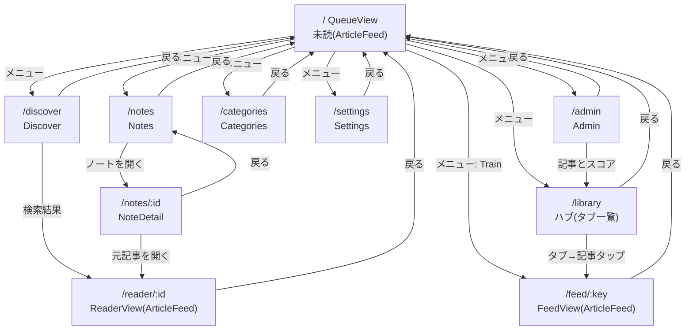

# 画面一覧と画面遷移

手動メンテのドキュメント。ルーターは `apps/app/src/client/router/index.ts`。

## アーキテクチャの要点（統合後）

- **記事表示は 1 コンポーネントに統合**: `ArticleFeed.vue`（カルーセル＋文脈依存アクションバー＋ノート入力）。
  ロジックは `composables/useArticleFeed.ts`、表示は `ArticleCard.vue`＋`ArticleCarousel.vue`。
- **「リスト」を中心概念**に: `unread` / `read` / `favorites` / `skipped` / `training` / `single`。
  どのリストも同じ `ArticleFeed` でカルーセル表示する。
- アクションバーは文脈依存（既読リストでは Read→**Unread**、お気に入りは ★ トグル、Skip は未読キューのみ）。

## 画面一覧

| ルート | ビュー | 役割 | 記事表示 |
|---|---|---|---|
| `/` | QueueView | 未読キュー（=リストの一つ）を `ArticleFeed` で表示。下部フローティングメニューが起点 | ArticleFeed（unread） |
| `/feed/:key` | FeedView | 任意リストのカルーセル（`unread`/`read`/`favorites`/`skipped`/`training`/`all`）。`?start=<記事ID>` で開始位置指定 | ArticleFeed |
| `/reader/:id` | ReaderView | 単一記事（Notes/Discover から）。1件だけの `ArticleFeed` に委譲 | ArticleFeed（single） |
| `/library` | LibraryView | ライブラリ＝ハブ。タブ（Unread/Train/Read/Favorites/Skipped/All）でサムネ一覧、タップで該当カルーセルへ | 一覧 |
| `/discover` | DiscoverView | ベクトル＋全文ハイブリッド検索 | 一覧→Reader |
| `/notes` | NotesView | ノート一覧 | — |
| `/notes/:id` | NoteDetailView | ノート詳細＋元記事リンク | — |
| `/categories` | CategoryView | カテゴリ管理（作成/編集/削除） | — |
| `/settings` | SettingsView | フィード追加/一覧、URL投入、嗜好プロファイル、取込状況 | — |
| `/admin` | AdminView | DB件数・キュー/ジョブ状態・サービスヘルス・読み取り専用SQL | — |

## 画面遷移図

## 補足

- `ArticleFeed` は表示中リストのキー（`listKey`）で「その記事がまだこのリストに属するか」を判定し、状態変更（既読/スキップ/お気に入り解除）でリストから外れた項目を自動的に取り除く。
- 読み方向トグル（右手/左手）で、カルーセルの並び・端タップ・スワイプ・アクションバーの並びが左右反転する。
- `/reader/:id` はルート契約維持のため残置（Notes/Discover から利用）。将来 `/feed/single` 系へ寄せる余地あり。
