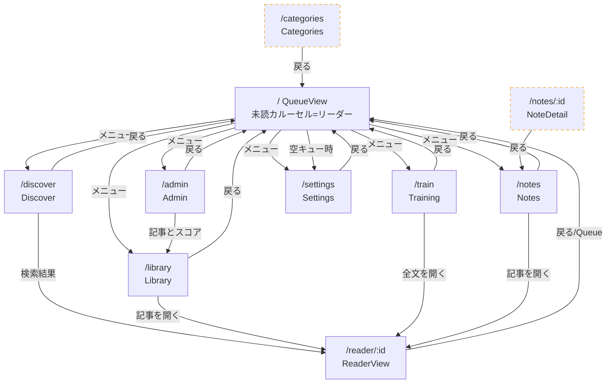

# 画面一覧と画面遷移

自動生成ではなく手動メンテのドキュメント。ルーターは `apps/app/src/client/router/index.ts`。

## 画面一覧

| ルート | ビュー | 役割 | 主な流入元 |
|---|---|---|---|
| `/` | QueueView | 未読キュー（横スクロールカルーセル）。**カード自体がリーダー**で本文HTML＋アイキャッチを表示。下部アクションバー＋フローティングメニュー | アプリ起点／各画面の「戻る」 |
| `/reader/:id` | ReaderView | 全画面リーダー（再読・深掘り用）。本文HTML＋アイキャッチ | Library / Notes / Discover / Train |
| `/discover` | DiscoverView | ベクトル＋全文ハイブリッド検索 | メニュー |
| `/library` | LibraryView | 既読・お気に入り・スキップ等をタブ絞り込みで一覧、再読 | メニュー / Admin |
| `/train` | TrainingView | スコアが際どい記事を Like/Dislike で評価（既読化しない） | メニュー |
| `/admin` | AdminView | DB件数・キュー/ジョブ状態・サービスヘルス・読み取り専用SQL | メニュー |
| `/notes` | NotesView | 保存済みノート一覧 | メニュー |
| `/notes/:id` | NoteDetailView | ノート詳細 | （現状リンク無し＝孤立） |
| `/categories` | CategoryView | カテゴリ管理（作成/編集/削除） | （現状リンク無し＝孤立） |
| `/settings` | SettingsView | フィード追加/一覧、URL投入、嗜好プロファイル、取込状況 | メニュー / 空キュー時 |

**記事本文を表示する画面は2つ**: `QueueView` のカルーセルカード（キュー内リーダー）と `ReaderView`（全画面リーダー）。`NoteDetailView` はノート本文であって記事本文ではない。

## 画面遷移図

（点線枠の `Categories` と `NoteDetail` は、どの画面からもリンクされていない孤立画面。直接URLでのみ到達可能。）

## 補足

- ほとんどの画面は左上「←」で `router.back()` も行うため、実際の戻り先は遷移元に依存する（図では代表的に `/` へ集約）。
- `QueueView` はカードがリーダーになったため、**キューから `/reader/:id` への遷移は無い**（「Full text」遷移は廃止済み）。
- 既知の未接続（要検討）:
  - `/categories`（CategoryView）はメニュー未登録。
  - `/notes/:id`（NoteDetailView）は NotesView が記事リーダー(`/reader/:id`)へ直接リンクしているため未使用。
